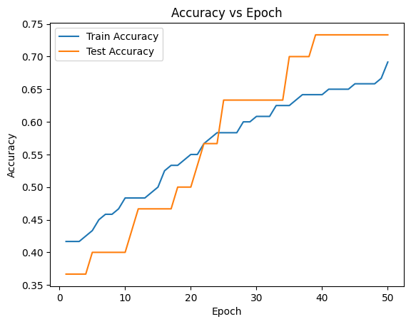

# AI/ML Internship Assessment

This repository contains my mini-assessment submission for an AI/ML internship.

---

## Part 1: Iris Flower Classification using PyTorch

This project demonstrates a simple neural network model built using PyTorch to classify iris flowers into 3 species based on 4 features:
- Sepal length
- Sepal width
- Petal length
- Petal width

### Dataset
- **Source**: `sklearn.datasets`
- **Classes**: Setosa, Versicolor, Virginica

### Model
- **Architecture**: 4-input → 16-hidden (ReLU) → 3-output
- **Loss**: CrossEntropyLoss
- **Training Epochs**: 50
- **Learning Rate**: 0.01
- **Manual Gradient Updates** (no high-level optimizers)

### Result
- Final Test Accuracy: **~75%**
- Training and test accuracy improved over time.

---

## Part 2: Generative AI using GPT-2

This part involves generating text using a GPT-2 model from Hugging Face Transformers.

### Prompt

"Once upon a time..."

### Method
- Used `generate.py` with temperature values:
  - **0.7** → More logical output
  - **1.0** → More creative/random output

### Output
- Saved in `generated_outputs.txt`

---

## Files in this Repository

| File | Description |
|------|-------------|
| `ML_Assessment.py` | Iris classification code |
| `accuracy_graph.png`    | Accuracy vs Epoch graph |
| `generate.py`          | GPT-2 text generation |
| `generated_outputs.txt`| Generated text |
| `Assessment_Report.pdf`     | Written summary of both parts |
| `README.md`            | This file |

---
